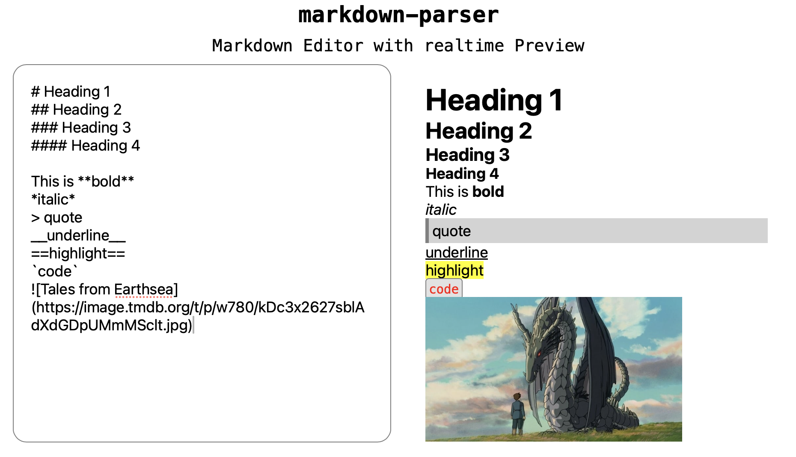

# Markdown Parser



A simple Markdown parser built with React that utilizes `dangerouslySetInnerHTML()`. **Note:** This approach is not recommended for production use, as it can expose your application to potential security risks, including the execution of malicious code.

## Supported Syntax

This Markdown parser supports the following syntax:

- **Headings**: Create headings of various levels.
- **Text Formatting**: Apply bold, italic, and underlined styles to text.
- **Highlighting**: Highlight text for emphasis.
- **Code Blocks**: Display code snippets with proper formatting.
- **Images**: Embed images within your Markdown content.
- **Horizontal Ruler**: Insert horizontal lines to separate content.

## References

For more information on Markdown syntax, check out the [Markdown Basic Syntax Guide](https://www.markdownguide.org/basic-syntax/).

## Installation

To try this Markdown parser, follow these steps:

1. Clone the repository:
   ```bash
   git clone https://github.com/schererleander/markdown-parser.git
2. Navigate to the project directory:
   ```bash
   cd markdown-parser
3. Install the dependencies:
   ```bash
   npm install
4. Start the development server:
   ```bash
   npm start
